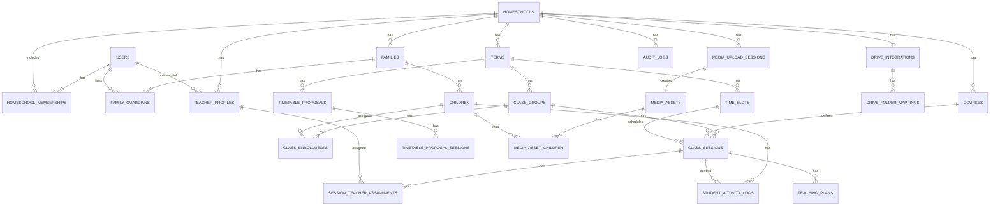

# 데이터 모델 및 ERD (MVP)

## 1) 모델링 원칙

- 홈스쿨 단위 멀티 테넌시를 기본으로 한다.
- 운영 데이터(학기, 반, 시간표)와 학습/미디어 데이터를 분리하되 연결 가능해야 한다.
- 시간표 충돌 검증을 위해 `time_slot` 및 `teacher_assignment`를 정규화한다.
- 채팅 기반 편성안은 본 시간표와 분리 저장 후 부분 적용한다.

## 2) 핵심 엔티티

### 계정/조직
- `users`
- `homeschools`
- `homeschool_memberships`
- `families`
- `family_guardians`
- `children`

### 운영
- `terms`
- `class_groups`
- `class_enrollments`
- `courses`
- `teacher_profiles`
- `teacher_availabilities`
- `time_slots`
- `class_sessions`
- `session_teacher_assignments`
- `timetable_proposals`
- `timetable_proposal_sessions`

### 학습/기록
- `teaching_plans`
- `student_activity_logs`
- `announcements`
- `audit_logs`

### 미디어/Drive
- `drive_integrations`
- `drive_folder_mappings`
- `media_upload_sessions`
- `media_assets`
- `media_asset_children`

## 3) ERD (개념)

## 4) 테이블 스펙 (요약)

### `users`
- `id` PK
- `email` unique
- `name`
- `phone`
- `status` (`ACTIVE`, `INACTIVE`)
- `created_at`, `updated_at`

### `homeschools`
- `id` PK
- `name`
- `owner_user_id` FK -> users
- `invite_code` unique
- `timezone`
- `created_at`, `updated_at`

### `homeschool_memberships`
- `id` PK
- `homeschool_id` FK
- `user_id` FK
- `role` (`HOMESCHOOL_ADMIN`, `PARENT`, `TEACHER`, `GUEST_TEACHER`, `STAFF`)
- `status` (`ACTIVE`, `PENDING`, `EXPIRED`)
- unique(`homeschool_id`, `user_id`, `role`)

### `families`
- `id` PK
- `homeschool_id` FK
- `family_name`
- `note`

### `children`
- `id` PK
- `family_id` FK
- `name`
- `birth_date`
- `profile_note`
- `status`

### `terms`
- `id` PK
- `homeschool_id` FK
- `name` (예: 2026 봄학기)
- `start_date`, `end_date`
- `status` (`DRAFT`, `ACTIVE`, `ARCHIVED`)
- `timetable_version` int

### `class_groups`
- `id` PK
- `term_id` FK
- `name` (예: 새싹반)
- `capacity`
- `main_teacher_id` FK nullable -> teacher_profiles

### `courses`
- `id` PK
- `homeschool_id` FK
- `name`
- `description`
- `default_duration_min`

### `time_slots`
- `id` PK
- `term_id` FK
- `day_of_week` (0-6)
- `start_time`, `end_time`
- unique(`term_id`, `day_of_week`, `start_time`, `end_time`)

### `class_sessions`
- `id` PK
- `class_group_id` FK
- `course_id` FK
- `time_slot_id` FK
- `title`
- `source_type` (`MANUAL`, `AI_PROMPT`)
- `status` (`PLANNED`, `CONFIRMED`, `CANCELED`)
- unique(`class_group_id`, `time_slot_id`)

### `session_teacher_assignments`
- `id` PK
- `class_session_id` FK
- `teacher_profile_id` FK
- `assignment_role` (`MAIN`, `ASSISTANT`)
- unique(`class_session_id`, `teacher_profile_id`)
- partial unique(`class_session_id`) where `assignment_role = MAIN`

### `timetable_proposals`
- `id` PK
- `term_id` FK
- `prompt` text
- `status` (`GENERATED`, `APPLIED`, `DISCARDED`)
- `generated_by_user_id` FK
- `summary_json`
- `created_at`

### `timetable_proposal_sessions`
- `id` PK
- `proposal_id` FK
- `class_group_id` FK
- `course_id` FK
- `time_slot_id` FK
- `teacher_main_id` FK
- `teacher_assistant_ids_json`
- `hard_conflicts_json`
- `soft_warnings_json`

### `drive_integrations`
- `id` PK
- `homeschool_id` FK unique
- `provider` (`GOOGLE_DRIVE`)
- `status` (`CONNECTED`, `DISCONNECTED`, `ERROR`)
- `root_folder_id`
- `connected_by_user_id` FK
- `connected_at`

### `drive_folder_mappings`
- `id` PK
- `drive_integration_id` FK
- `mapping_type` (`TERM`, `CLASS_GROUP`, `CHILD`)
- `mapping_key`
- `folder_id`

### `media_upload_sessions`
- `id` PK
- `homeschool_id` FK
- `uploader_user_id` FK
- `status` (`PENDING`, `UPLOADING`, `COMPLETED`, `FAILED`)
- `mime_type`
- `size_bytes`
- `target_folder_id`
- `created_at`, `expires_at`

### `media_assets`
- `id` PK
- `homeschool_id` FK
- `upload_session_id` FK unique
- `drive_file_id`
- `drive_web_view_link`
- `uploader_user_id` FK
- `class_group_id` FK nullable
- `class_session_id` FK nullable
- `title`
- `description`
- `media_type` (`PHOTO`, `VIDEO`)
- `captured_at`

### `media_asset_children`
- `id` PK
- `media_asset_id` FK
- `child_id` FK
- unique(`media_asset_id`, `child_id`)

## 5) 필수 무결성 제약

- 동일 `time_slot`에 대해 동일 교사가 2개 이상 세션 배정되면 안 된다.
- 동일 `class_group`에는 동일 `time_slot`에 1개 세션만 존재해야 한다.
- `class_sessions`의 `time_slot`은 해당 `term` 범위에 포함되어야 한다.
- `ARCHIVED` 학기의 운영 테이블(`class_groups`, `class_sessions`, `assignments`) 수정 금지.
- `drive_integrations`는 홈스쿨당 1개 활성 연결만 허용.

## 6) 인덱스 권장

- `class_sessions(class_group_id, time_slot_id)`
- `session_teacher_assignments(teacher_profile_id)`
- `time_slots(term_id, day_of_week, start_time)`
- `timetable_proposals(term_id, created_at desc)`
- `media_assets(homeschool_id, captured_at desc)`
- `media_asset_children(child_id)`
- `audit_logs(homeschool_id, created_at)`
